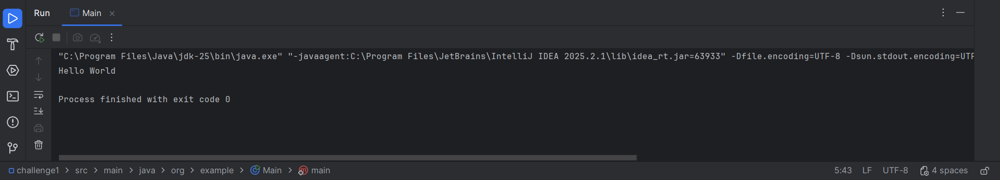

# Hello World in Java 

A simple Java program that prints **“Hello World”** to the console.  

---

## 📁 Project Structure
```
challenge1:
-src:
   main:
      java:
        org:
          example:
             Main.java
- img.png
- pom.xml
- README.md 

```

---

## 🧑‍💻 Author & Copyright
© 2025 **Kosala Gayani**  
All rights reserved.

---

## ⚙️ Prerequisites

Before running the program, make sure you have the following installed:

- **Java Development Kit (JDK)** – version 8 or higher
- **Git** – to clone the repository

---

## 🚀 How to Run the Program

Follow these steps to set up and run the project:

1. **Clone the repository**
   ```bash
   git clone https://github.com/kosala509/challenge1.git

2. **Navigate to the project folder**
   ```bash
   cd challenge1

3. **Compile the Java file**
   ```bash
   javac src/main/java/org/example/Main.java

4. **Run the program**
   ```bash
   java -cp src/main/java org.example.Main

5. **Expected output**
   
   Hello World

## 📚 Official Documentation

**For more details about Java, visit the official documentation**

👉 link: "https://docs.oracle.com/javase/"

## 🖼️ Program Output




